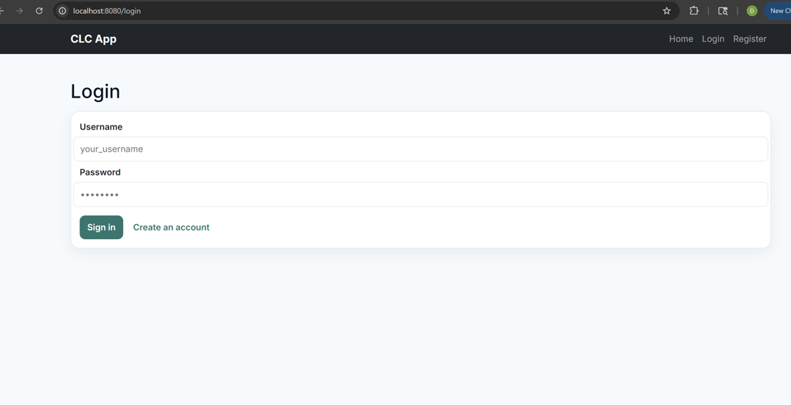
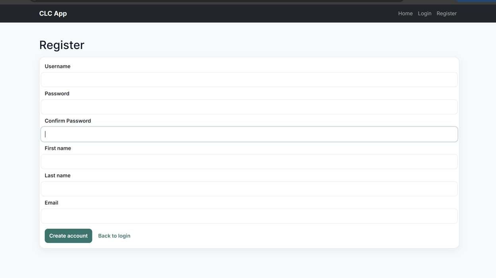
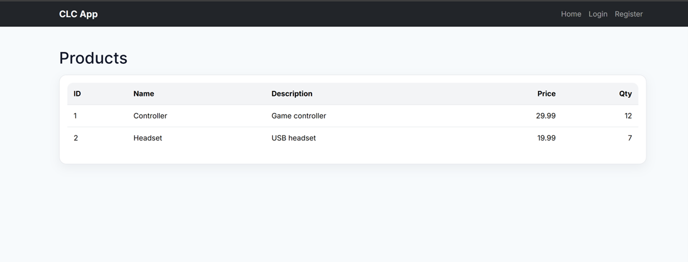
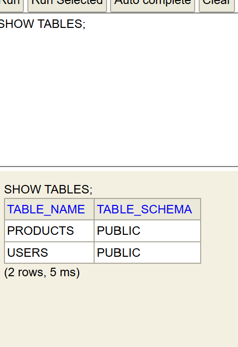
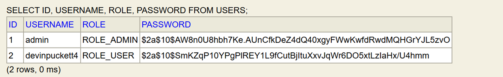

**Name:Devin Puckett**  
**Course:Cst-339**  
**Date:09/25/2025** 

**Professor:Bobby Estey**

---

## - CLC Login

This is my custom login page wired to Spring Security. Unauthenticated users are redirected here and the form posts to the /login endpoint with CSRF protection. After a successful sign in it routes to the products page, and there is a link to create an account if you need one. The page is built with Thymeleaf and matches the app’s navbar and styling.

---

## - The Registration Page

This is the edit screen for one product. The form is prefilled with the current values. When I hit Save it sends a post to the update endpoint and then redirects it back to the list. I added basic checks so price and quantity cannot be negative. 

---

## - Shows Products Page

This is the secured Products page that only loads after a successful login. The table is rendered with Thymeleaf and reads its rows from the H2 database through Spring Data JDBC. I preloaded two sample records from data.sql to verify end-to-end data flow. This screen is what users hit after login to confirm authorization is working.

---

## - Showing H2 Table

This is the H2 console showing the USERS table. The first view shows the seeded admin account with a BCrypt hashed password and role set to ROLE_ADMIN. After I registered through the app, the second view shows my new user added with ROLE_USER and its own BCrypt hash. This proves the app is using the database for auth and registration is saving users correctly.

---

## - Showing H2 Console

This is the H2 console showing the USERS table. The first view shows the seeded admin account with a BCrypt hashed password and role set to ROLE_ADMIN. After I registered through the app, the second view shows my new user added with ROLE_USER and its own BCrypt hash. This proves the app is using the database for auth and registration is saving users correctly.

## - Showing H2 Console Added User

This is the USERS table in the H2 console. It shows two accounts: the seeded admin with ROLE_ADMIN and my registered user devinpuckett4 with ROLE_USER. Passwords are stored as BCrypt hashes, so nothing is in plain text and Spring Security is in effect. This confirms registration and the startup seeding both worked and the app is using the database for authentication.

## - Conclusion
For this milestone I refactored authentication to Spring Security and moved login and registration to a database-backed flow. All pages are locked down except login and register, and passwords are stored as BCrypt hashes in H2. An admin user is seeded at startup, and new users can register and then sign in to reach the products page. The H2 console shows the USERS and PRODUCTS tables with real data, which confirms the app is using the database for authentication. The project builds and runs with the Maven wrapper and the code is pushed to GitHub.
